# 📦 InvenSync — Documentação Técnica

> Sistema de controle de almoxarifado de **TI** (toner, cilindros, periféricos, peças e ativos)
> da **Refrigerantes Jaboti**. Aplicação web em **Flask** com banco **PostgreSQL**, servida em
> produção via **waitress** e gerenciada por um **launcher** desktop (PyQt5).

| | |
|---|---|
| **Nome** | InvenSync |
| **Domínio** | Almoxarifado de TI |
| **Stack** | Python 3.12 · Flask 3 · SQLAlchemy 2 · PostgreSQL 17 · Bootstrap 5 |
| **Servidor** | waitress (produção) / run.py (dev) |
| **Repositório** | https://github.com/nerdGG094/InvenSync |

---

## 1. Visão Geral

O InvenSync controla o estoque do setor de TI, com cadastro de produtos (com campos específicos
como marca, modelo, patrimônio, número de série, localização, compatibilidade e validade),
fornecedores, categorias, e o registro de **movimentações** de entrada e saída. Possui painel com
indicadores, board **Kanban** de saúde de estoque, relatórios, exportação CSV e gestão de usuários
com controle de acesso (ativo/inativo).

### Tecnologias

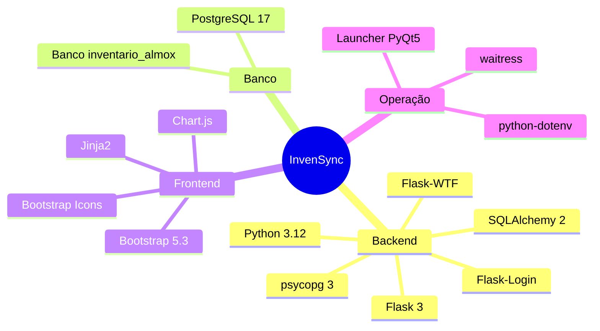

---

## 2. Arquitetura em Camadas

A aplicação segue uma arquitetura em camadas (layered), separando apresentação, regras de acesso a
dados e domínio.

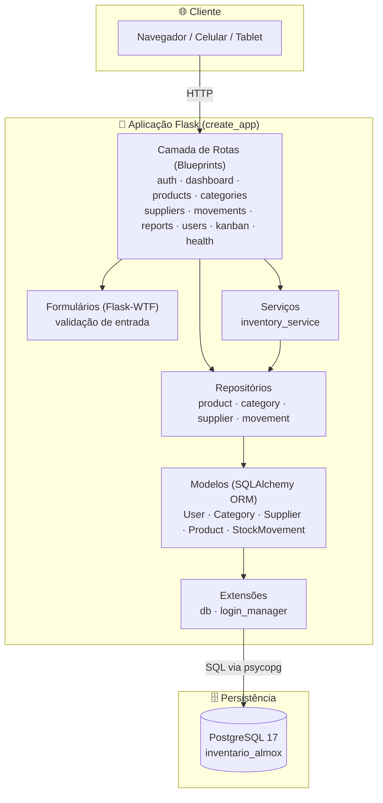

---

## 3. Modelo de Dados (Diagrama Entidade-Relacionamento)

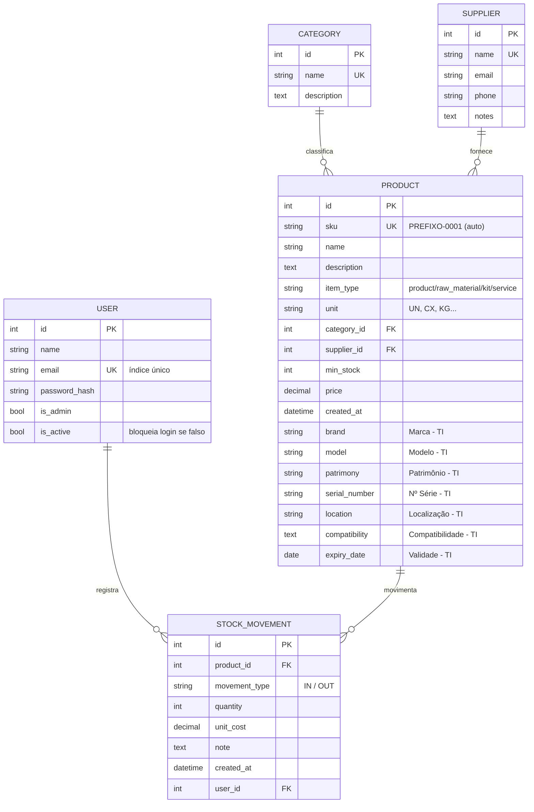

### 3.1 Dicionário de Dados

#### Tabela `user`
| Campo | Tipo | Nulo | Descrição |
|---|---|---|---|
| id | integer (PK) | não | Identificador |
| name | varchar(120) | não | Nome do usuário |
| email | varchar(255) UK | não | E-mail (login), índice único |
| password_hash | varchar(255) | não | Hash da senha (scrypt) |
| is_admin | boolean | sim | Perfil administrador |
| is_active | boolean | não | Se inativo, não consegue logar |

#### Tabela `category`
| Campo | Tipo | Nulo | Descrição |
|---|---|---|---|
| id | integer (PK) | não | Identificador |
| name | varchar(120) UK | não | Nome único da categoria |
| description | text | sim | Descrição |

#### Tabela `supplier`
| Campo | Tipo | Nulo | Descrição |
|---|---|---|---|
| id | integer (PK) | não | Identificador |
| name | varchar(200) UK | não | Razão/nome único |
| email | varchar(255) | sim | Contato |
| phone | varchar(50) | sim | Telefone |
| notes | text | sim | Observações |

#### Tabela `product`
| Campo | Tipo | Nulo | Descrição |
|---|---|---|---|
| id | integer (PK) | não | Identificador |
| sku | varchar(120) UK | não | Código único (gerado `PREFIXO-0001`) |
| name | varchar(200) | não | Nome do item |
| description | text | sim | Descrição |
| item_type | varchar(20) | não | Tipo (product/raw_material/kit/service) |
| unit | varchar(10) | não | Unidade de medida (UN, CX, KG...) |
| category_id | integer (FK→category) | sim | Categoria |
| supplier_id | integer (FK→supplier) | sim | Fornecedor |
| min_stock | integer | sim | Estoque mínimo (alerta) |
| price | numeric(12,2) | sim | Preço |
| created_at | timestamp | sim | Data de criação |
| brand | varchar(120) | sim | **TI** — Marca (HP, Brother...) |
| model | varchar(120) | sim | **TI** — Modelo (TN-660...) |
| patrimony | varchar(60) | sim | **TI** — Nº de patrimônio |
| serial_number | varchar(120) | sim | **TI** — Nº de série |
| location | varchar(120) | sim | **TI** — Localização física |
| compatibility | text | sim | **TI** — Equipamentos compatíveis |
| expiry_date | date | sim | **TI** — Validade (toner/cilindro) |

#### Tabela `stock_movement`
| Campo | Tipo | Nulo | Descrição |
|---|---|---|---|
| id | integer (PK) | não | Identificador |
| product_id | integer (FK→product) | não | Produto movimentado |
| movement_type | varchar(3) | não | `IN` (entrada) ou `OUT` (saída) |
| quantity | integer | não | Quantidade |
| unit_cost | numeric(12,2) | sim | Custo unitário (entradas) |
| note | text | sim | Observação |
| created_at | timestamp | sim | Data/hora da movimentação |
| user_id | integer (FK→user) | sim | Quem registrou |

> **Saldo de estoque** = Σ(quantidade `IN`) − Σ(quantidade `OUT`) por produto.

---

## 4. Diagrama de Classes (UML)

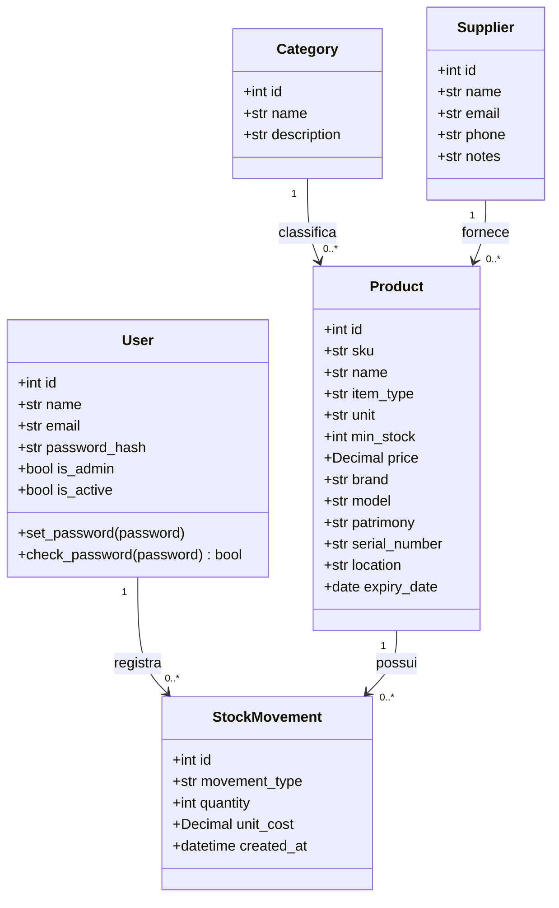

---

## 5. Diagrama de Implantação (Deployment)

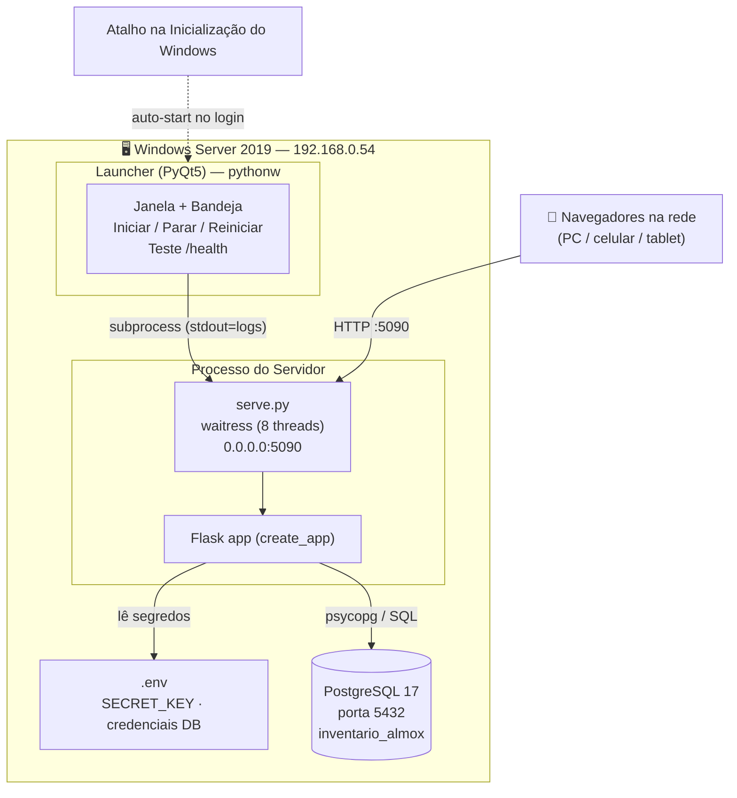

---

## 6. Diagramas de Sequência

### 6.1 Login (com bloqueio de usuário inativo)

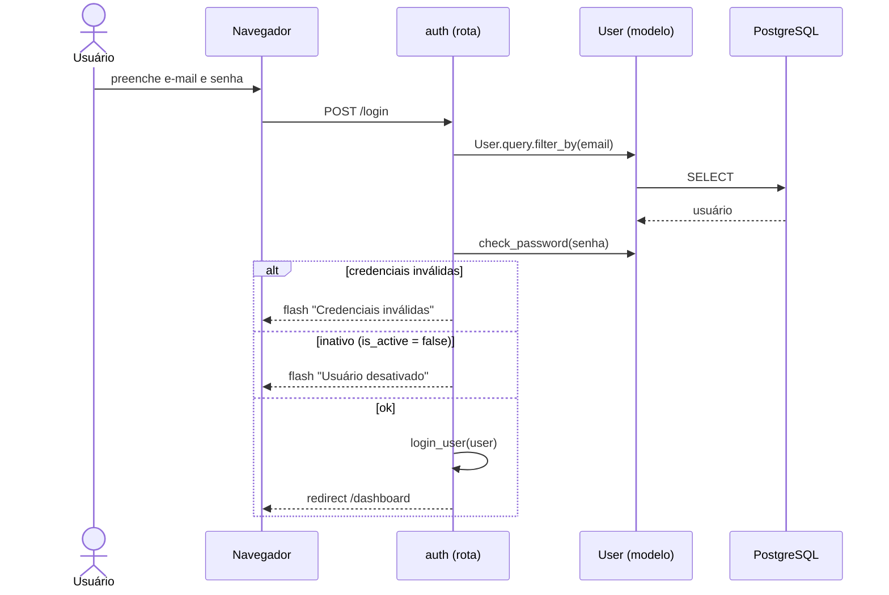

### 6.2 Cadastro de Produto com SKU automático

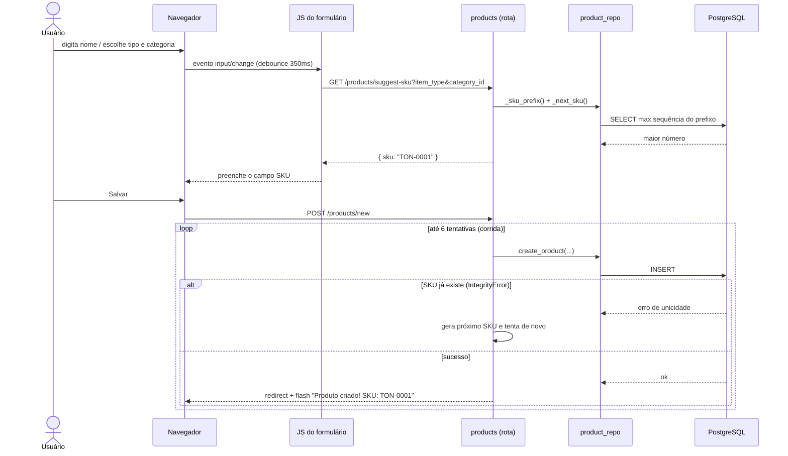

### 6.3 Registro de Movimentação de Estoque

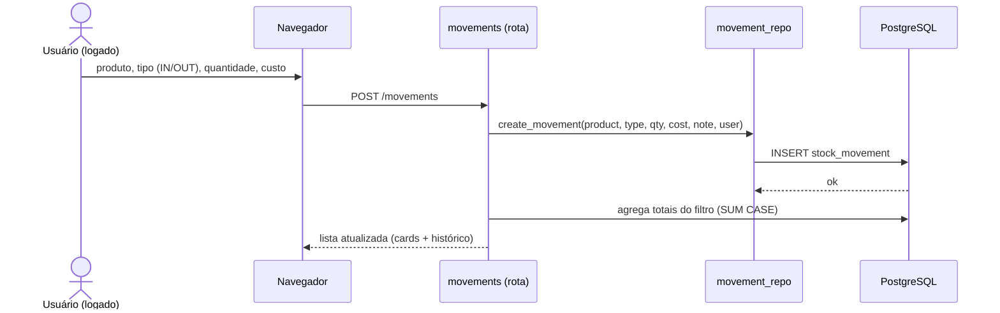

---

## 7. Fluxogramas de Regras de Negócio

### 7.1 Geração do SKU

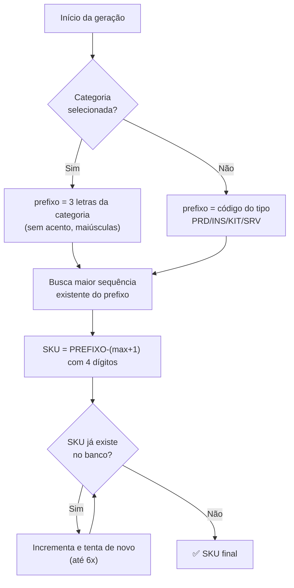

### 7.2 Classificação do Kanban de Estoque

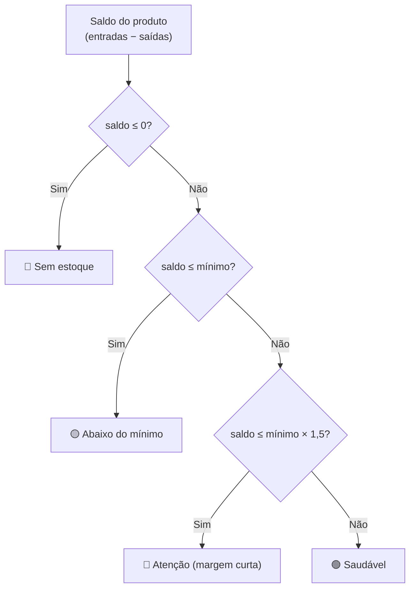

---

## 8. Diagramas de Estado

### 8.1 Servidor (visto pelo Launcher)

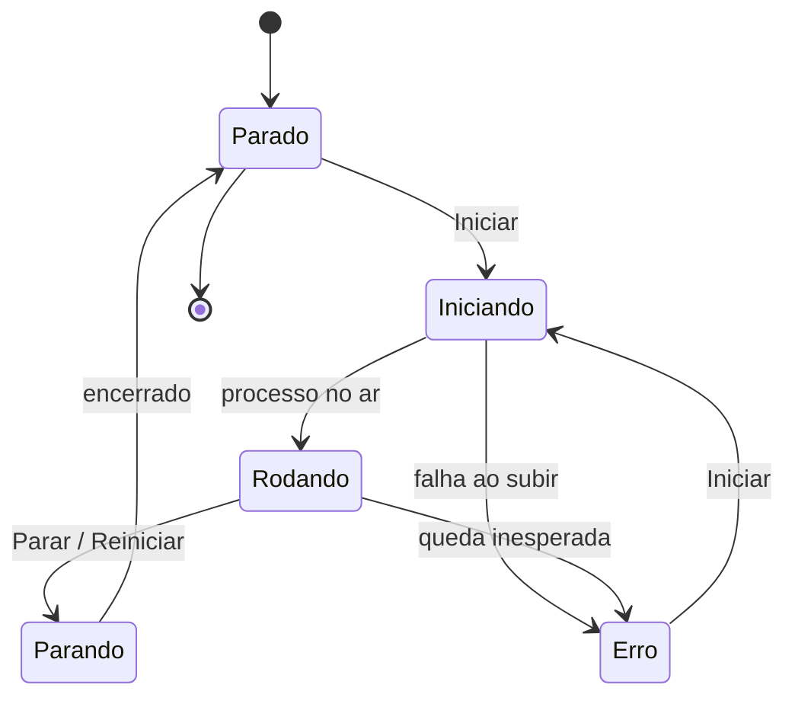

### 8.2 Acesso do Usuário

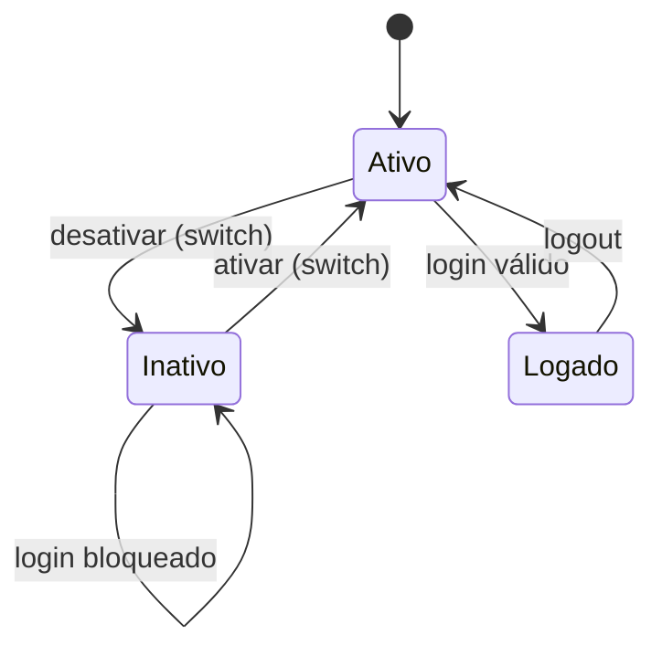

---

## 9. Casos de Uso

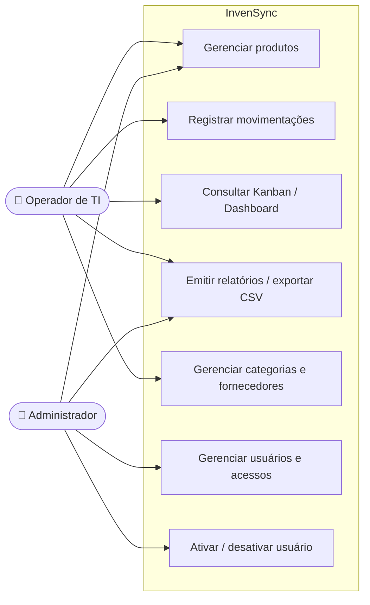

---

## 10. Mapa de Rotas (Endpoints)

| Método | Rota | Blueprint | Descrição | Login |
|---|---|---|---|---|
| GET/POST | `/login` | auth | Autenticação | — |
| GET | `/logout` | auth | Encerrar sessão | — |
| GET | `/` | dashboard | Painel com indicadores e gráficos | ✅ |
| GET | `/products` | products | Lista de produtos | ✅ |
| GET/POST | `/products/new` | products | Cadastrar (SKU automático) | ✅ |
| GET/POST | `/products/<id>/edit` | products | Editar produto | ✅ |
| POST | `/products/<id>/delete` | products | Excluir produto | ✅ |
| GET | `/products/suggest-sku` | products | Sugerir próximo SKU (JSON) | ✅ |
| GET/POST | `/categories` … | categories | CRUD de categorias | ✅ |
| GET/POST | `/suppliers` … | suppliers | CRUD de fornecedores | ✅ |
| GET/POST | `/movements` | movements | Registrar e listar movimentações | ✅ |
| GET | `/reports/stock` | reports | Relatório de estoque | ✅ |
| GET | `/reports/export/products.csv` | reports | Exportar CSV | ✅ |
| GET | `/kanban` | kanban | Board de saúde de estoque | ✅ |
| GET/POST | `/users` … | users | Gestão de usuários (admin) | ✅ |
| POST | `/users/<id>/toggle-active` | users | Ativar/desativar usuário | ✅ |
| GET | `/health` | health | Status do serviço (JSON) | — |

---

## 11. Estrutura de Pastas

```text
InventarioAlmox/
├── inventory/                 # pacote da aplicação
│   ├── __init__.py            # create_app() — fábrica do app
│   ├── config.py              # configuração (lê .env)
│   ├── extensions.py          # db, login_manager
│   ├── models/                # ORM: user, category, supplier, product, movement
│   ├── repositories/          # acesso a dados por entidade
│   ├── services/              # regras de domínio (inventory_service)
│   ├── forms/                 # formulários Flask-WTF
│   ├── routes/                # blueprints (auth, products, ... , health)
│   ├── templates/             # Jinja2 (base + telas)
│   └── static/                # style.css, logo, favicon
├── docs/
│   └── DOCUMENTACAO.md        # este documento
├── setup/
│   ├── install.bat            # instala deps + atalhos (Desktop/Startup)
│   └── start_invensync.bat    # inicia o launcher (pythonw)
├── launcher.py                # painel desktop PyQt5
├── serve.py                   # servidor de produção (waitress)
├── run.py                     # servidor de desenvolvimento (Flask)
├── migrate_sqlite_to_pg.py    # migração única SQLite → PostgreSQL
├── requirements.txt
├── .env / .env.example        # segredos (não versionado / modelo)
└── README.md
```

---

## 12. Segurança e Configuração

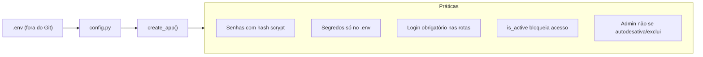

- **Variáveis sensíveis** (`SECRET_KEY`, `DB_PASSWORD`, …) ficam no `.env`, fora do versionamento.
- **Senhas** armazenadas como hash (`werkzeug` / scrypt) — nunca em texto puro.
- **Acesso**: todas as telas exigem login; usuários **inativos** não logam.
- **Proteções de admin**: não é possível desativar nem excluir a própria conta.

---

## 13. Como Executar

### Produção (recomendado)
```bat
:: 1. Instala dependências e cria atalhos (Desktop + Inicialização)
setup\install.bat

:: 2. Inicia o painel (auto-sobe o servidor waitress)
setup\start_invensync.bat
```
Acesse: **http://192.168.0.54:5090**

### Desenvolvimento
```bat
.venv\Scripts\python run.py
```

### Migração inicial (uma vez)
```bat
.venv\Scripts\python migrate_sqlite_to_pg.py
```

---

> _Documentação gerada para o projeto InvenSync. Os diagramas usam **Mermaid** e são renderizados
> automaticamente no GitHub, VS Code (extensão Markdown Preview Mermaid) e demais visualizadores compatíveis._
